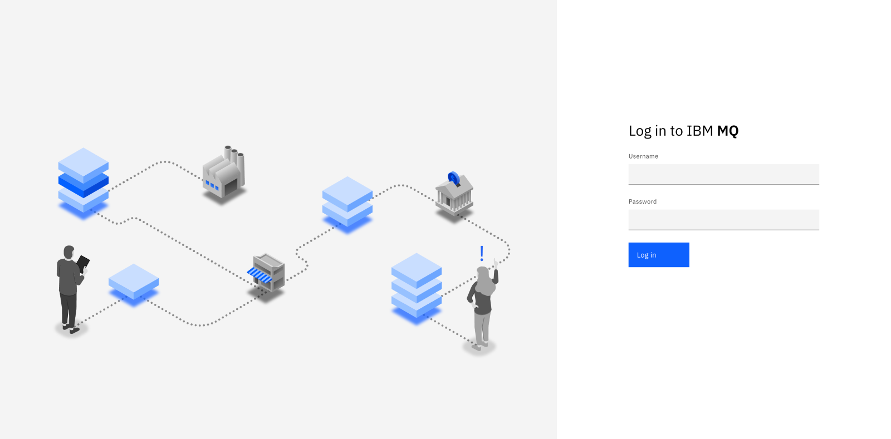
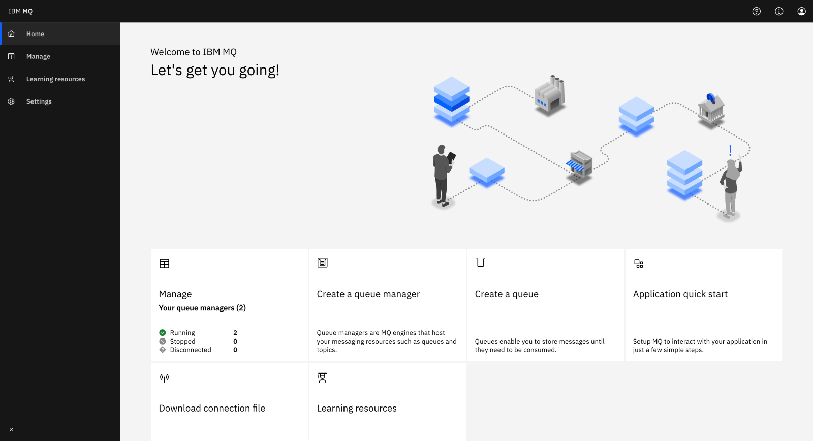
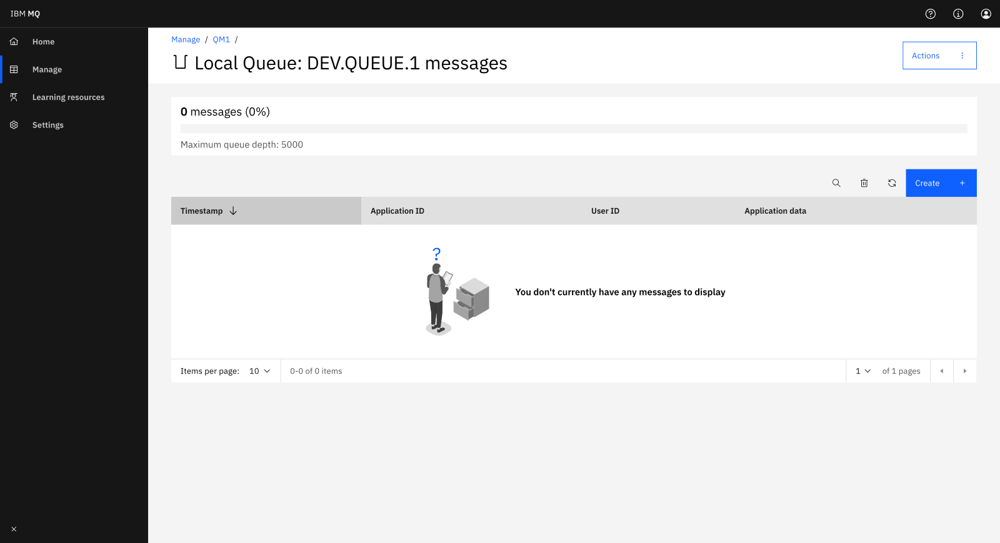
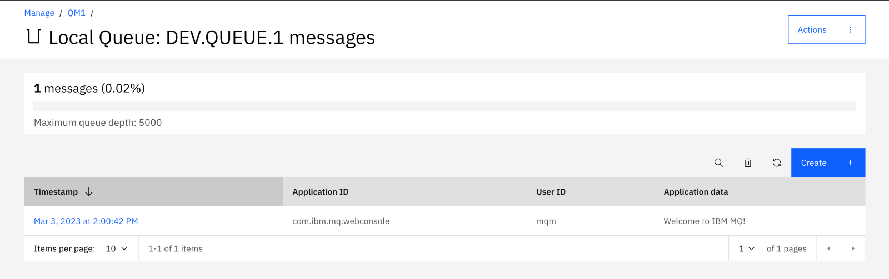

# [DRAFT] Run IBM MQ with Python MQI on macOS (Apple Silicon)  

Demonstrates the Point-to-Point Messaging pattern, a reliable, one-to-one message flow between a producer and a consumer via a queue.

📌 This assumes you have completed IBM’s MQ Fundamentals learning path 

https://developer.ibm.com/learningpaths/ibm-mq-badge/mq-fundamentals/

This tutorial picks up right after the concepts you learned there.
You already know what queue managers, queues, channels and listeners are.

Here you’ll create your own local Developer Edition queue manager in a container and connect to it from Python using the MQI.

It’s the practical next step: take the point-to-point pattern you saw conceptually and run it end-to-end on your Mac.

https://github.com/ibm-messaging/mq-mqi-python  

**Goal:** Run a local IBM MQ Developer Edition queue manager in a container on macOS arm64, and connect to it using the official IBM MQ Python MQI (`ibmmq`) library.  

This tutorial shows how to:
- Run IBM MQ Developer Edition (9.4+) in Podman on macOS (Apple Silicon or Intel)
- It will expose:
  - Port 1414 → MQ listener for applications
  - Port 9443 → MQ Console (web UI)
- Connect to it from a Python app using the IBM MQ MQI (`ibmmq`) library
- Send and receive messages programmatically

By the end, you’ll have a working producer and consumer written in Python communicating through a local MQ queue manager.

---

### Prerequisites
- macOS 13 or later (Intel or Apple Silicon)  
- Podman 5.x  
- Homebrew  
- Python 3.10+ (Conda, pyenv, or system Python are all fine)

---

### Step 1 — Install the IBM MQ client toolkit  
The Python MQI library needs the MQ C client libraries installed locally.

```bash
brew tap ibm-messaging/ibmmq
brew install ibmmq-client
```

Then verify the toolkit is available:

```bash
ls /opt/mqm/lib64
```

If you see `libmqic_r.dylib` and similar libraries, you’re good.


**Why this matters:**
The Python MQI library links to these C libraries. Without them, the Python client cannot connect to a queue manager.


---

### Step 2 — Create and activate a Python environment

e.g. with conda 

```bash
conda create -n mq python=3.10 -y
conda activate mq
pip install ibmmq
```
**Why this matters:**
This isolates the MQ Python dependencies and ensures you’re using the correct MQI bindings.

---

### Step 3 — Initialize a Podman machine  
Apple Silicon uses a Linux VM under the hood.  
Create and start it once:

```bash
podman machine init --cpus 4 --memory 4096 --disk-size 30
podman machine start
podman info
```


---

### Step 4 — Create MQ secrets for the app and admin user

```bash
printf 'adminpass' | podman secret create mqAdminPassword -
printf 'apppass'  | podman secret create mqAppPassword -
```

List to confirm:

```bash
podman secret ls
```

You should see both secrets listed.

**Why this matters:**
These credentials populate admin (MQ Console) and app (client application) accounts for the developer configuration.

---

### Step 5 — Run the MQ Developer Edition container  
Create and run the queue manager (`QM1`) with the developer configuration.

```bash
podman run -d \
  --name mq-adv \
  --platform linux/amd64 \
  -p 1414:1414 -p 9443:9443 \
  -e LICENSE=accept \
  -e MQ_QMGR_NAME=QM1 \
  -e MQ_DEV=true \
  -e MQ_CONNAUTH_USE_HTP=true \
  --secret source=mqAdminPassword,type=mount,target=mqAdminPassword \
  --secret source=mqAppPassword,type=mount,target=mqAppPassword \
  --volume mqdata:/mnt/mqm \
  --shm-size=256m \
  icr.io/ibm-messaging/mq:9.4.4.0-r1
```

Then check that it’s up:

```bash
podman ps
podman logs -f mq-adv | grep "Web application available"
```

Once you see `QM1 started` and `mqweb server is ready`, you can open the MQ Console:  
🔗 https://localhost:9443/ibmmq/console


#### Recap: What was created?

| MQ object         | Name              | Purpose                                                 |
| ----------------- | ----------------- | ------------------------------------------------------- |
| **Queue manager** | `QM1`             | The central MQ server process                           |
| **Listener**      | Port `1414`       | Accepts client connections                              |
| **App channel**   | `DEV.APP.SVRCONN` | Client apps connect over this                           |
| **Default queue** | `DEV.QUEUE.1`     | Your producer will PUT messages here; consumer will GET |
| **MQ Console**    | Port `9443`       | Web UI for inspecting the queue manager                 |


---

### Step 7 — Explore the queue manager using MQ Console  

Now that QM1 is running, you can inspect its queues, channels, and messages using the IBM MQ Console.
This helps you connect the Python examples back to the objects you saw in the IBM MQ Fundamentals path.

#### 1. Open the Console  
Navigate to: https://localhost:9443/ibmmq/console


**Login with:** 
User: `admin`  
Password: `adminpass`

Your browser will warn about an unsafe connection — this is expected because the queue manager uses a **self-signed certificate**.  
Accept the warning to continue.




Log in with:

- **User:** `admin`
- **Password:** the value of your `mqAdminPassword` secret

You can change the password later if you want.

---

#### 2. View queue manager **QM1**

From the Home page, click **Manage QM1**.




Here you can see:

- Queue manager status  
- Queues, channels, and listeners  
- Configuration details  
- Monitoring and usage statistics  

---

#### 3. Inspect the queue you’ll use in Python

Go to **Queues** → choose **DEV.QUEUE.1**.

This is the queue your Python scripts will:

- **PUT** messages to (producer)  
- **GET** messages from (consumer)



From this page, you can:

- View existing messages  
- Create a test message  
- See message details (payload + MQMD metadata)

Try clicking **Create** to add a message.  
You’ll see it appear immediately in the message list.




Back in another terminal

Start the consumer:

```bash
python consumer.py
```

You should see the message come in!

expected output:

```bash
Connecting to QM1 via DEV.APP.SVRCONN@localhost(1414) as app …
Waiting for messages on DEV.QUEUE.1 (timeout 5000 ms). Ctrl+C to stop.
GET #1: Hello world!  (MsgId=)
```

You can also use the producer.py file to add messages to the queue:

```bash
python producer.py
```
expected output:

```bash
Connecting to QM1 via DEV.APP.SVRCONN@localhost(1414) as app …
PUT: msg 1/5 @ 1763131487.491  (MsgId=414d5120514d31202020202020202020ce3d176901760040)
PUT: msg 2/5 @ 1763131487.550  (MsgId=414d5120514d31202020202020202020ce3d176902760040)
PUT: msg 3/5 @ 1763131487.607  (MsgId=414d5120514d31202020202020202020ce3d176903760040)
PUT: msg 4/5 @ 1763131487.663  (MsgId=414d5120514d31202020202020202020ce3d176904760040)
PUT: msg 5/5 @ 1763131487.719  (MsgId=414d5120514d31202020202020202020ce3d176905760040)
```

Then go back to the console to check if the messages arrive :) 


---


**What’s happening behind the scenes**

Your Python scripts:

1. Connect to queue manager QM1
2. Use channel DEV.APP.SVRCONN for client access
3. Send and receive messages on DEV.QUEUE.1
4. Use port 1414 to communicate with the MQ listener you saw running in the container

You’ve just exercised the exact point-to-point pattern introduced in the MQ Fundamentals path, but now running fully on your Mac using real MQ code.

🎉 **You’re done!**

You now have:
- A working IBM MQ Developer queue manager running in Podman  
- A Python MQI client successfully connecting, putting, and getting messages


## Troubleshooting

- Cannot connect to Podman / socket errors:
  - Run: podman machine start
  - Then: podman info
- 2035 NOT_AUTHORIZED in Python:
  - Ensure you created secrets mqAdminPassword and mqAppPassword
  - Container must be started with MQ_CONNAUTH_USE_HTP=true
  - Use user=app password=apppass and channel DEV.APP.SVRCONN
- 2059 / 2538 (connectivity):
  - Confirm container is Up and port 1414 is published
  - Use localhost(1414) and channel DEV.APP.SVRCONN
- Queue open errors (2037):
  - Open the queue with input and/or output flags as needed
- Field/keyword errors in ibmmq:
  - GMO/PMO fields are CamelCase (Options, WaitInterval, Persistence)
  - Queue.put()/get() often require positional args, not keywords
- Apple Silicon:
  - Use --platform linux/amd64 on pull/run
  - If your Podman version lacks --arch on machine init, just use --platform on the container


## Inspect MQ directly

Show current queue depth from inside the container:

podman exec -it mq-adv runmqsc QM1 <<'EOF'
dis ql(DEV.QUEUE.1) curdepth
end
EOF


## Cleanup

Stop and remove the container and secrets:

```bash
podman stop mq-adv
podman rm mq-adv
podman secret rm mqAdminPassword mqAppPassword
```

(Optional) remove the named volume:

```bash
podman volume rm mqdata
```


